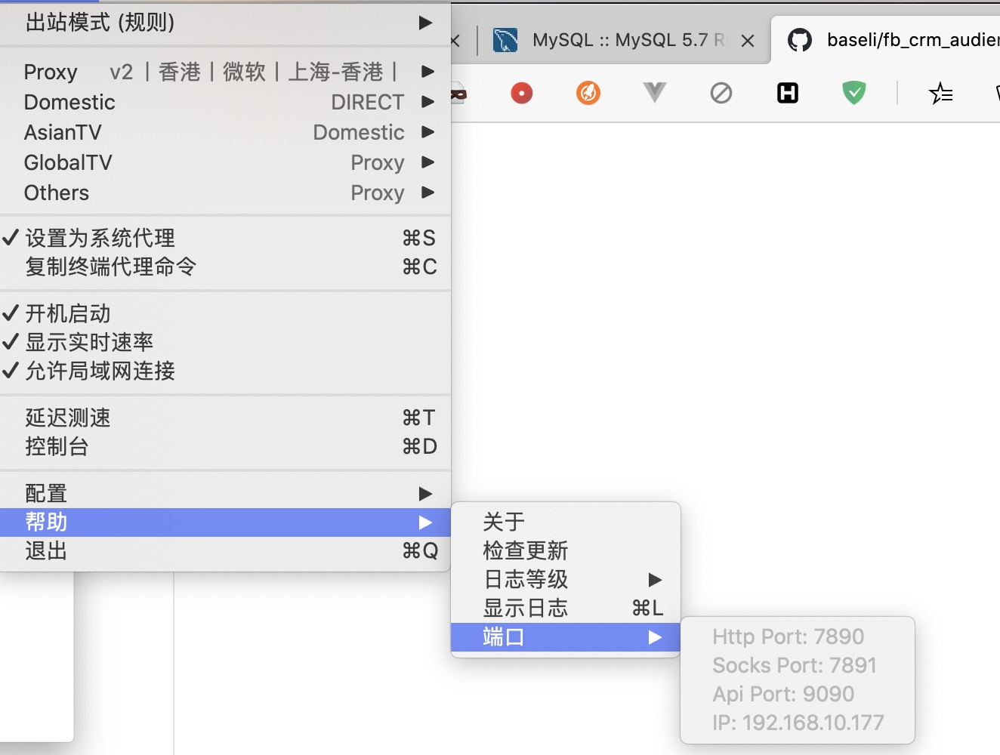

### `facebook` 受众上传
为了解决多个广告账号上传相同的受众，因此开发了本应用。数据安全性有保障，只会存在自己电脑本地，不会发生邮箱数据泄露的情况。
#### 打包
##### 技术方案
* `go + sqlite` 组成后端服务
* `electron + vue` 组成界面部分
##### 本地环境版本
* golang 1.14.6
* yarn v1.22.4
##### 注册 `facebook` 应用
[注册地址](https://developers.facebook.com/apps/)
* 需要添加 `facebook login` 和 `facebook marketing api`
* `facebook login` 中登录回调地址应该修改为 `https://www.facebook.com/connect/login_success.html`
##### 配置修改
1. 修改 `pkg/facebook/Config.go` 中的配置部分
```go
const (
	appId 			= ""
	appSecret 		= ""
	graphApiPrefix 	= "https://graph.facebook.com/"
	graphVersion	= "v9.0"
)
```
2. 修改 `electron/index.js` 中回调地址部分
```javascript
sub.loadURL(`https://www.facebook.com/v8.0/dialog/oauth?client_id={facebook_app_id_here}&redirect_uri=https://www.facebook.com/connect/login_success.html&state=${new Date().getTime()}&response_type=token&scope=email,public_profile,ads_management`)
```
修改上述中 `{facebook_app_id_here}` 为真实 `appId` 即可
##### 打包
这里以 `mac` 为例
```bash
make
```
执行完成只会，会发现在 `electron/dist` 目录中会生成 `windows` 和 `mac` 版本
#### 使用
如果网络处于被墙状态，需要自备 `vpn` 然后开启本地 `http` 代理，然后在软件中设置即可

1. `clashx`，可以看到端口为 `7890`，则设置为 `http://127.0.0.1:7890`

2. `shadowsocks`，可以看到端口为 `1087`，需要将 `shadowsocks` 的本地 `http` 打开，则设置代理地址为 `http://127.0.0.1:1087`

